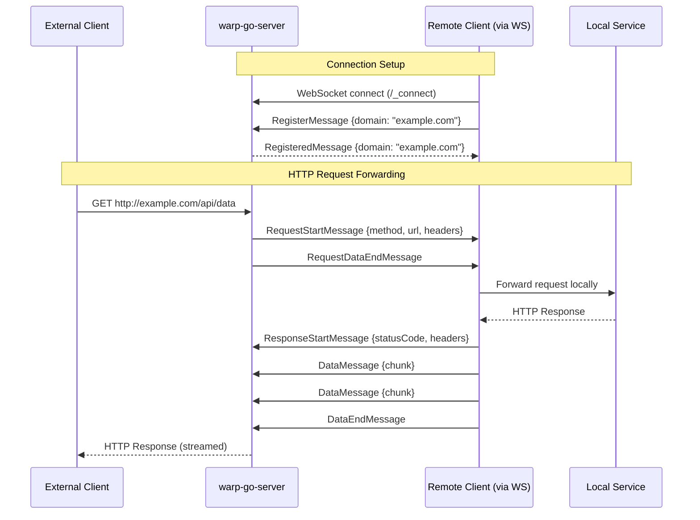
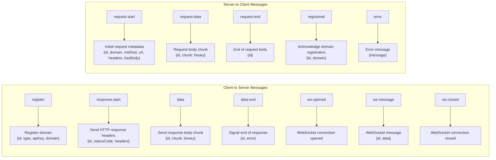
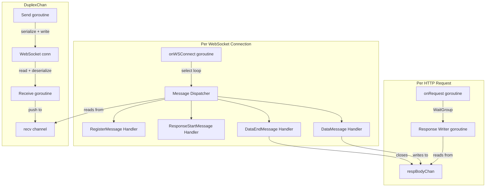

# warp-go-server

A reverse proxy tunneling server written in Go that forwards HTTP requests to remote clients over WebSocket connections. It enables exposing local services to the internet without direct inbound connectivity.

## Overview

`warp-go-server` acts as a relay between external HTTP clients and local services. A remote client connects to the server via WebSocket, registers the domain(s) it wants to handle, and the server forwards all matching HTTP requests to that client. The client processes each request locally and streams the response back through the WebSocket tunnel.

```
External Request → warp-go-server → WebSocket Tunnel → Local Service
```

## Architecture

```mermaid
graph TB
    subgraph Internet
        A[HTTP Client]
    end

    subgraph warp-go-server
        B[HTTP Server :8001]
        C[Tracing Middleware]
        D[Logging Middleware]
        E[/_connect\nWebSocket Handler]
        F[/*\nRequest Handler]
        G[/_healthcheck\nHealth Check]
        H[(hostToClientID\nSync Map)]
        I[(serverStates\nSync Map)]
    end

    subgraph Remote Client
        J[WebSocket Client]
        K[Local Service\ne.g. localhost:3000]
    end

    A -->|HTTP Request| B
    B --> C --> D
    D --> E
    D --> F
    D --> G
    E -->|Upgrade to WS| J
    J -->|RegisterMessage| H
    F -->|Lookup host| H
    H -->|clientID| I
    I -->|DuplexChan| J
    J <-->|Bidirectional\nMessage Stream| K
```

## Request Flow



## Message Protocol



## Wire Format

Messages use a custom binary protocol that combines JSON metadata with an optional binary payload:

```
┌─────────────────────────────────────────────────────────┐
│  4 bytes (LE)  │  N bytes (JSON)  │  M bytes (binary)   │
│  metadata len  │  message metadata│  binary payload     │
└─────────────────────────────────────────────────────────┘
```

This allows efficient streaming of binary data (e.g., response bodies) without base64 encoding.

## Getting Started

### Prerequisites

- Go 1.22.3+

### Build

```bash
git clone https://github.com/mcandeia/warp-go-server.git
cd warp-go-server
go build -o warp-go-server .
```

### Run

```bash
./warp-go-server
# Server listens on :8001 by default

./warp-go-server -port 9000
# Listen on a custom port
```

## API Endpoints

| Endpoint | Method | Description |
|---|---|---|
| `/_connect` | `GET` (WebSocket) | Client connection endpoint — upgrades to WebSocket |
| `/_healthcheck` | `GET` | Returns `200 OK` when healthy, `503` during shutdown |
| `/*` | `*` | Catch-all — proxies all other requests to the registered client |

## Configuration

| Flag | Default | Description |
|---|---|---|
| `-port` | `8001` | Port the server listens on |

## Project Structure

```
warp-go-server/
├── main.go                          # Entry point, middleware setup, graceful shutdown
└── pkg/server/
    ├── server.go                    # Core server: WebSocket handler and request proxy
    ├── messages.go                  # Message type definitions and handlers
    ├── messages_serializer.go       # Custom binary+JSON serializer
    ├── arraybuffer_serializer.go    # Binary wire format implementation
    ├── json_serializer.go           # Generic JSON serializer
    ├── ws.go                        # Generic bidirectional WebSocket channel
    ├── writable_stream.go           # Thread-safe streaming buffer
    └── server_test.go               # Tests
```

## Concurrency Model



## Graceful Shutdown

On `SIGTERM` or `SIGINT`:
1. The server stops accepting new connections
2. The health check endpoint returns `503 Service Unavailable`
3. Existing connections are given 30 seconds to complete
4. The server exits cleanly

## Dependencies

| Package | Purpose |
|---|---|
| `github.com/gorilla/websocket` | WebSocket implementation |
| `github.com/google/uuid` | Unique IDs for clients and requests |
